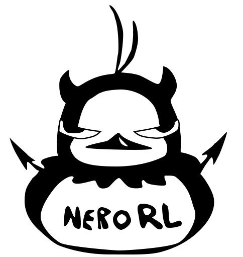

# Contents

- [Installation](installation.md)
- [Train a model](training.md)
- [Evaluate a model](evaluation.md)
- [Evaluate model checkpoints](evaluate_checkpoints.md)
- [Enjoy (i.e. watch) a model](enjoy.md)
- [Configuration File](configuration.md)
- [Model Architecture](model.md)
- [Steps to add another environment](add_environment.md)
- [Tensorboard](tensorboard.md)
