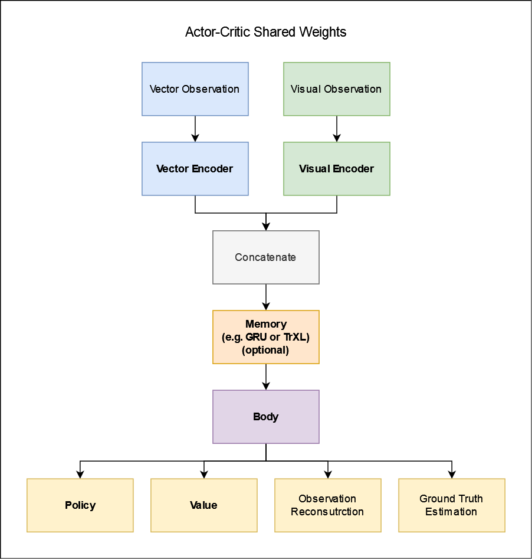

# Model Architecture

An abstract definition of the model's architecture is shown in the figure below.
Each component marked as bold can be customized and referenced inside the configuration file.
The next section gives a more detailed view on the model when trained on Obstacle Tower.

## Example: Obstacle Tower

The actor-critc architecture of the underlying model can be described best by assuming that we are going to train an agent on the Obstacle Tower environment, because it uses both vector and visual observation spaces as well as a Multi-Discrete action space.

1. At first the stacked RGB frames of the visual observation space are fed to three convolutional layers, which are configured similarly to the ones typically used for Atari games.

2. After that, the output of the last convolutional layers is flattened.

3. The vector observation, featuring game state variables, is concatenated to the previous output.

4. If `recurrence` is setup in the [config](configuration.md), a recurrent layer is added right after this concatenation.

5. The propagation proceeds with a fully connected layer.

6. After that, the network is split into two branches: one is for the value function and the other one for the policy.

7. Both branches move on with a fully connected layer.

8. The value function is one of the model's heads.

9. Concerning the policy head, if a Multi-Discrete action space is used, the policy is branched off for each available action dimension.
